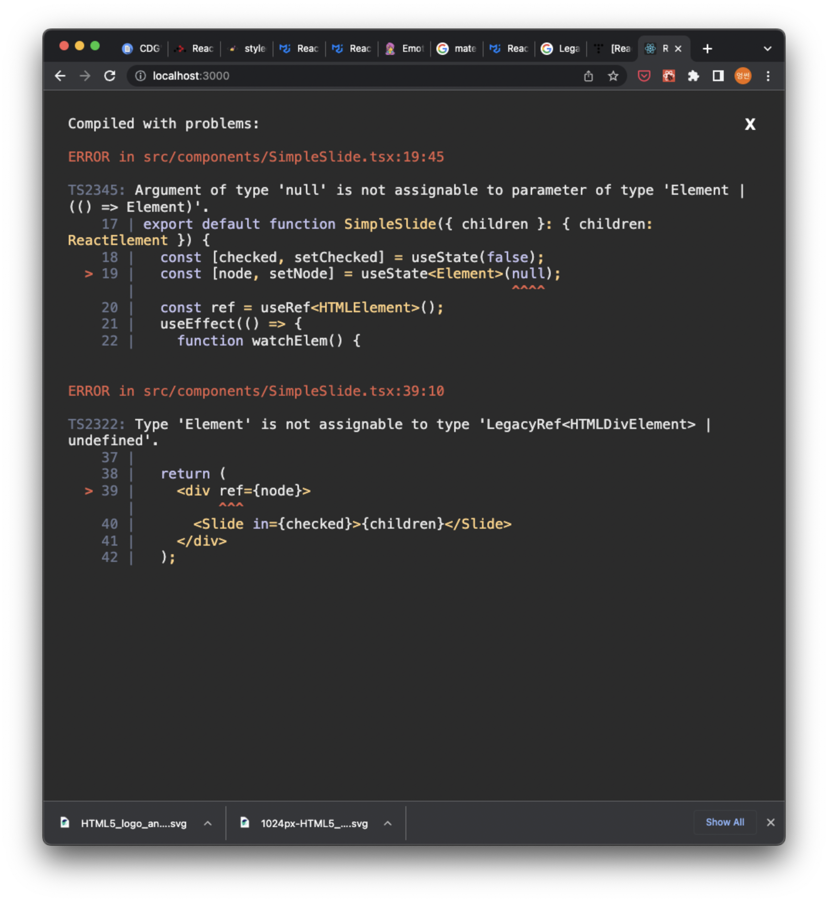
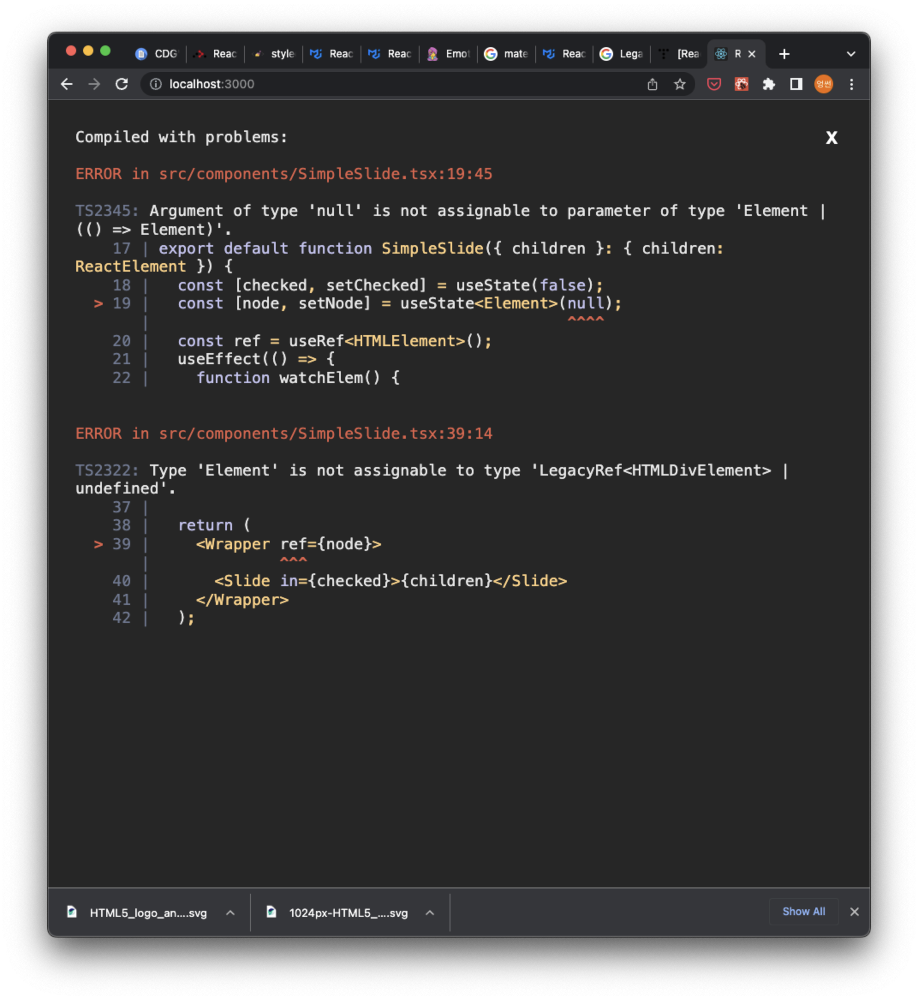

## issue 001: 스크롤 애니메이션을 구현하기 위해 useRef를 쓸 때 생기는 오류

Created: 2022.04.28

1. 먼저 해당 코드와 오류의 내용을 아래에 올린다.




```tsx
const Wrapper = styled.div`
  width: 300px;
  height: 500px;
`;

export default function SimpleSlide({ children }: { children: ReactElement }) {
  const [checked, setChecked] = useState(false);
  const [node, setNode] = useState<Element>(null);
  const ref = useRef<HTMLElement>();
  useEffect(() => {
    function watchElem() {
      const observer = new IntersectionObserver(
        (entries) => {
          entries.forEach((entry) => {
            if (entry.isIntersecting) {
              setChecked(true);
            }
          });
        },
        { root: null, rootMargin: "0px", threshold: 1.0 }
      );
      if (ref.current !== null) observer.observe(node);
    }
    watchElem();
  }, []);

  return (
    <div ref={node}>
      <Slide in={checked}>{children}</Slide>
    </div>
  );
}
```

2. `<Wrapper/>`를 `<div>`로 변경해도 어딘가 같은 곳에 문제가 있는 것 같다. 일단은 `useRef`를 사용하는 방식에 근본적인 문제가 있는 것으로 생각되어서 그와 관련된 블로그를 찾아보도록 한다.

### 참고

- https://zerodice0.tistory.com/244
